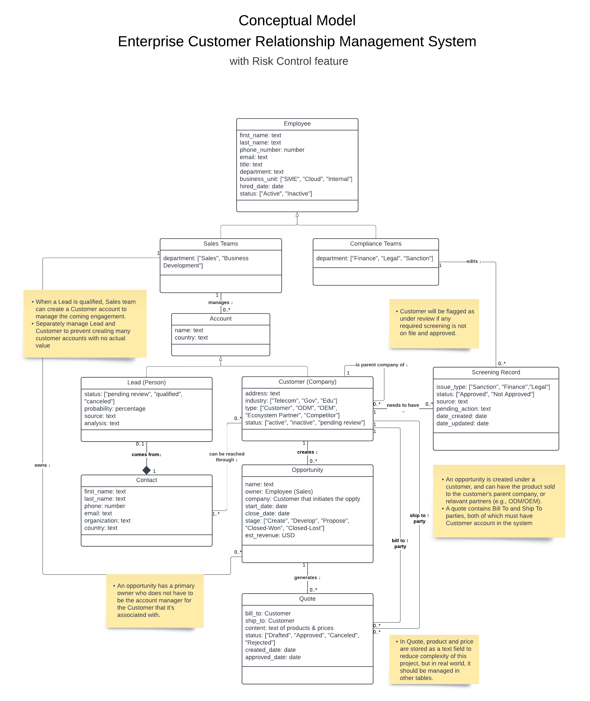
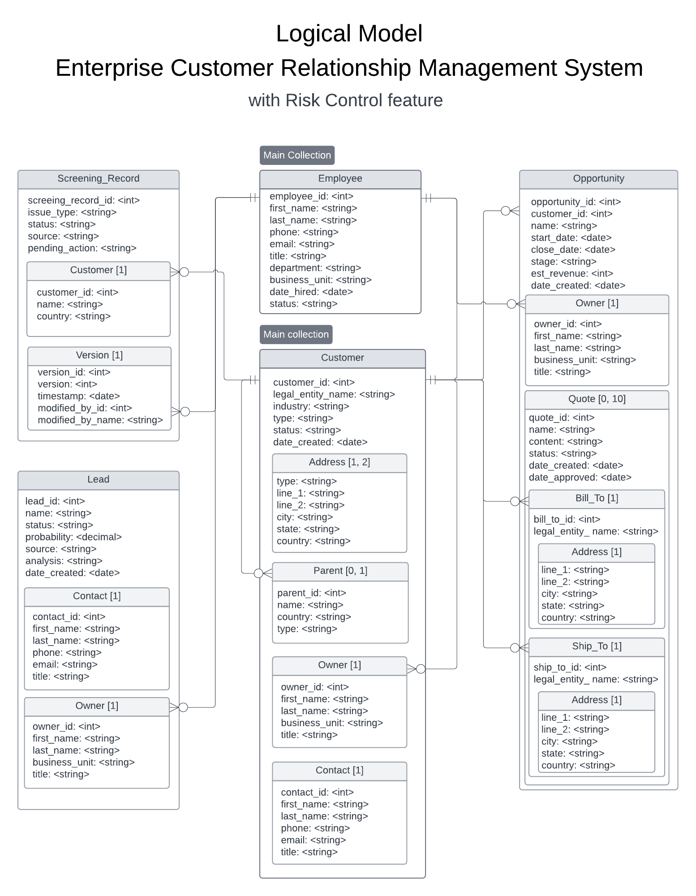

# Redis Integration for Customer Relationship Management System

This project integrates Redis with the Customer Relationship Management System developed in the [previous enhanced CRM project](https://github.com/amyhuang95/enhanced_CRM_mongoDB).
The system is built using Node.js and Express.js. MongoDB is used as the primary database, and
**Redis is used as an in-memory key-value storage for caching to optimize speed for retrieving recently added or viewed information**.

## Conceptual Model (UML Class Diagram)

<!--
describe the functionalities that you selected to be used as an in-memory key-value storage, (e.g. most viewed products, a shopping cart, current logged-in users, etc).
 -->

**In-memory key-value storage:**
The five most recently added or viewed opportunities of each customer are cached in Redis.



## Logical Model

### MongoDB Schema


Refers to example JSON objects of each collection in the [db/json_examples.js](db/json_examples.js) file.
The comments describe some rules for the fields.
([link](https://lucid.app/lucidchart/2da1e4e2-e400-4acb-af34-0afa0a122638/edit?view_items=JWWowJgIFUbH&invitationId=inv_f5a92ee0-36d3-4dac-9cdf-52bdf0759fc8) to Lucidchart)

### Redis Schema

<!--
Describe the Redis data structures that you are going to use to implement the functionalities you described in the previous point. (example To implement the most viewed products I will use a Redis sorted set with key "mostViewed:userId", product ids as the values and a score of the number of views of the product.). You can use/describe more than one data structure, you will need to implement at least one.
 -->

#### Data structure description

To implement the caching of recently added or viewed **5** opportunities for each customer, we use Redis **sorted set**.
The key is `recentOppty:customer_id`, which represents the opportunities of a specific customer.
The value is a list of unique opportunity IDs with the timestamps as their scores.
The set is updated whenever an opportunity is added, viewed/edited, or deleted.

#### Redis Commands for CRUD Operations

Initialize:

```Redis
FLUSHALL
```

Get the list of 5 recently added or viewed opportunities for customer with id `customer_id`:

```Redis
ZREVRANGE recentOppty:<customer_id> 0 4
```

When an opportunity `oppty_id` is added for a customer `customer_id`:

```Redis
ZADD recentOppty:<customer_id> <timestamp> <oppty_id>
```

When opportunity `oppty_id` is viewed/updated for customer `customer_id`:

```Redis
ZADD recentOppty:<customer_id> <timestamp> <oppty_id>
```

When an opportunity `oppty_id` is deleted for customer `customer_id`:

```Redis
ZREM recentOppty:<customer_id> <oppty_id>
```

## Databases Setup

This project uses MongoDB as the primary database and Redis as the caching layer. To use the databases, install the required tools, clone this repository, navigate to this project's directory, and run the following commands in the terminal.

1. Tools required:

   - [MongoDB](https://www.mongodb.com/try/download/community) for the database server. By default, MongoDB runs on `localhost:27017`. Below commands assume this configuration.
   - [MongoDB Database Tools](https://www.mongodb.com/try/download/database-tools) for importing and exporting data.
   - [MongoDB Compass](https://www.mongodb.com/try/download/compass) for viewing the data in a user interface.
   - [Redis](https://redis.io/download) for the caching server. By default, Redis runs on `localhost:6379`.
   - [RedisInsight](https://redislabs.com/redis-enterprise/redis-insight/) for viewing the data in a user interface. To use, run the server and go to http://localhost:8001 in your browser.

2. There are two ways to regenerate the sample database in MongoDB.

   1. Using mongorestore to load data from dump files.

      ```bash
      mongorestore db/dump/
      ```

   2. Using mongoimport to load data from each of the JSON files to a databases called `crm`. Change the file name to load different collections (Customer, Employee, Lead, Opportunity, Screening Record).

      ```bash
      mongoimport -d crm --jsonArray --file db/sample_data/[filename].json
      ```

## Caching System

<!--
Create a node script that implements your redis design. See for example this one implementing a basic Caching system with Mongo and Redis
-->

The web application implements the Employee and Customer collections. It is built using Node.js and Express.js. To run the web application, clone this repository, navigate to the webapp directory, and run the following commands in the terminal:

1. Install the required packages:

   ```bash
   npm install
   ```

2. Start the server:

   ```bash
   npm start
   ```

3. Go to http://localhost:3000 in your browser to view the web application.

---

_This project was developed as part of the course CS 5200 Database Management Systems taught by Professor John Alexis Guerra Gomez at Northeastern University (Oakland)._
